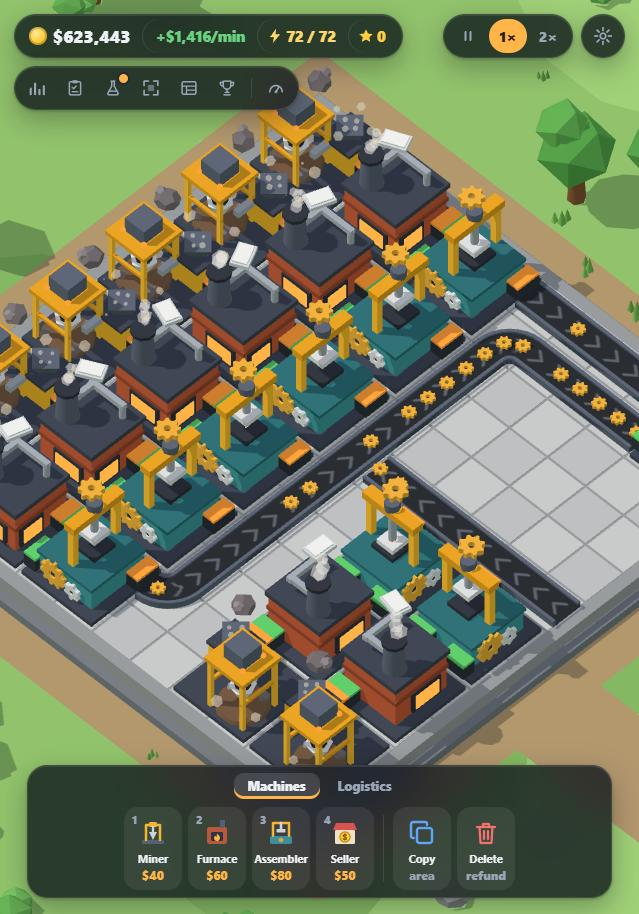

# One More Machine

> Build it. Optimize it. Watch it work.

**[Play it in your browser](https://diablo-1029.github.io/OneMoreMachine/)** — nothing to install, and it saves as you go.



A browser-based 3D factory automation game. Place machines, join them with conveyors, watch
items move, find the bottleneck, and fix it — usually with one more machine.

Built with Vite, TypeScript and Three.js. There are no art or audio assets: every model is
assembled from primitives in code and every sound is synthesised with Web Audio.

## Playing

Miners dig ore, Furnaces and Assemblers turn it into things worth more, and Sellers turn
those into money. Conveyors join them up. Spend the money on more machines, research and
floor space; when something backs up or sits idle, find the bottleneck and fix it. The game
has a short walkthrough and a *How to play* page on its menu.

It runs in current versions of Chrome, Edge, Firefox and Safari, with a mouse and keyboard
or by touch on a tablet. Phones work but are cramped. Progress is stored in the browser;
*Settings → Download save* gives you a file to keep or move to another device.

## Running it from source

```bash
npm install
npm run dev
```

The dev server runs on port 5183.

| Script | What it does |
|---|---|
| `npm run dev` | Development server with hot reload |
| `npm run build` | Typecheck, then build for production into `dist/` |
| `npm run preview` | Serve the production build |
| `npm test` | Run the unit tests (vitest) |
| `npm run typecheck` | TypeScript only |
| `npm run lint` | ESLint |

Adding `?slot=name` to the URL uses a separate save, which is handy for trying things
without touching your real factory.

## Controls

| Input | Action |
|---|---|
| Left click | Place / select |
| Left drag | Lay belts; pan the view with the select tool |
| Right click | Cancel the current tool |
| Right or middle drag | Pan |
| Wheel | Zoom |
| `W` `A` `S` `D` | Pan |
| `Q` / `E` | Rotate the view |
| `R` | Rotate the piece being placed, or the selection |
| `1`–`9`, `0` | Build tools; each tool keeps its number |
| `` ` `` | Next group of build tools |
| `F` | Pick the tool for whatever is under the cursor |
| `X` | Delete tool |
| `Ctrl+C` / `Ctrl+V` | Copy an area / paste it |
| `Del` | Remove the selection |
| `Ctrl+Z` | Put back what was last removed |
| `B` | Bottleneck view |
| `T` `C` `G` `P` | Research, Contracts, Achievements, Blueprints |
| `Space` | Pause |
| `Home` | Centre the view |

## What is in the game

- **Production**: ore → plates → gears, a copper line for wire, then motors, steel, circuits,
  computers and robots.
- **Logistics**: conveyors, splitters, mergers, bridges (so belts can cross) and storage.
- **Bottleneck tools**: per-machine efficiency, a bottleneck view, and plain-language advice
  on what to add.
- **Progression**: research, machine upgrades, power, factory expansion, contracts,
  achievements and prestige.
- **Interface**: a top bar that only shows what the factory has grown into, tooltips and
  key hints for whatever you are doing, a card on any machine you point at, and settings for
  interface size and reduced motion.
- **Quality of life**: copy-paste and saved blueprints, offline progress, three environments
  and unlockable floor, belt and lighting styles.

## How the code is organised

```
src/
  core/        The simulation. No rendering, no DOM; fully unit-tested.
    game/        Simulation, game state, fixed-timestep ticks, tutorial, offline progress, prestige
    factory/     Machines, conveyors, routers, items
    grid/        Grid, occupancy, placement validation
    economy/     Money and pricing
    stats/       Throughput metrics and bottleneck analysis
    save/        Serialisation, validation and version migrations
    research/ contracts/ achievements/ blueprints/ power/ recipes/
  data/        Balance and content: machines, recipes, research, environments, cosmetics…
  rendering/   Three.js scene. Reads simulation state; never changes it.
  machines/    One 3D model per machine type
  input/       Pointer, keyboard and placement logic
  ui/          HUD and panels in plain HTML/CSS
  audio/       Synthesised sound
  app/         Wiring: App, GameSession, GameLoop
tests/         Unit tests for the simulation
```

Two rules hold everything together:

1. **The simulation is the source of truth.** Rendering visualises it and input sends it
   commands. Nothing in `core/` imports Three.js.
2. **Content is data.** A new resource, recipe, machine, research node or achievement is an
   entry in `src/data/`, plus a model if it needs one.

## Releasing

Every push runs the checks in `.github/workflows/ci.yml`. Pushes to `main` are also built and
published to GitHub Pages by `deploy.yml`, once the repository is public and Pages is switched
on (Settings → Pages → Source: GitHub Actions). The build uses relative paths, so `dist/` can
equally be zipped and uploaded elsewhere, such as itch.io.

## Saves

The game autosaves to IndexedDB with a mirror in localStorage. Saves carry a version number
and are upgraded step by step on load (`src/core/save/Migration.ts`); every loaded save is
validated, and one that cannot be restored is reported rather than crashing the game.

A save can be downloaded as a file and loaded again from the menu or Settings; a loaded file
goes through the same upgrade and validation as any other save.

## License

[MIT](LICENSE)
